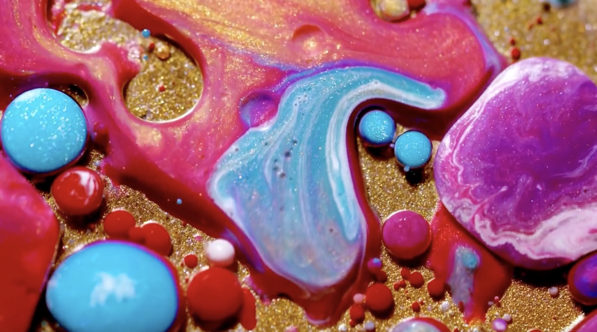
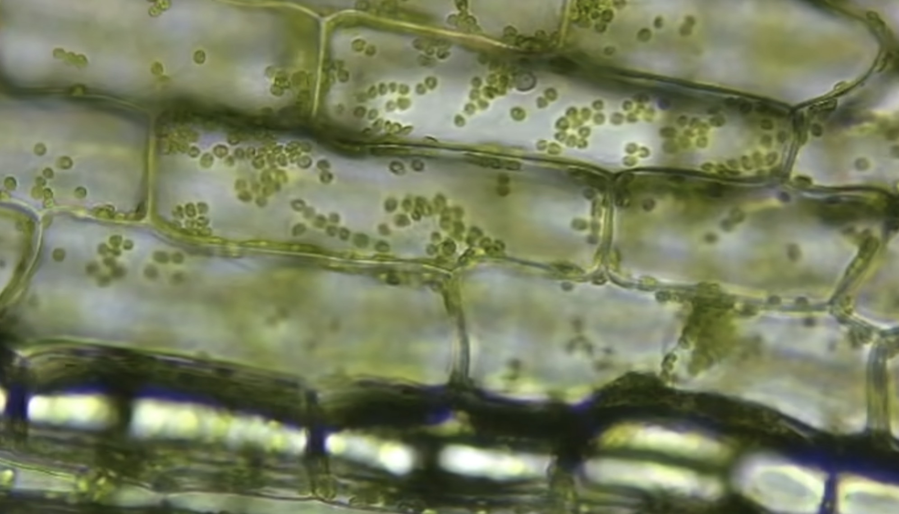

# yluo0801_9103_TUT1
Week 8 quiz

# Part 1
I want to choose the "Wheels of fortune" in the work requirements as my assignment.
Based on the inspiration from a fluid art video and a cell flow video, I hope to make the small round beads in the background flow and the big circle rotate, while the whole picture moves up and down or left and right, presenting a visual effect that the big circle rotate and flow in a certain direction. 

# Part 2
Creates multiple circles on a specified path and sets their colors and delays respectively to make them look like they are flowing or moving. This code helps me make the small circles in the "Wheels of Fortune" flow along the gaps of big circles.
Then, creates the visual effect of a rotating ring by changing coordinates to generate arcs and sectors. This code makes the big circle of the "Wheel of Fortune" rotate.
[Preview of the moving circle](https://www.bootstrapmb.com/item/7271/preview)
[Preview of the rotating ring](https://www.bootstrapmb.com/item/13480/preview)

